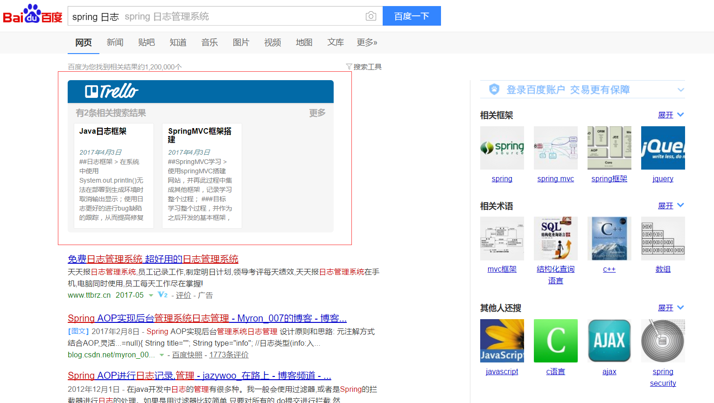

## Trello search Chrome extension
> 在搜素页面，提取搜索关键字在trello中搜索，并将搜索结果在页面中展示；
> 灵感来源于`Evernote/印象笔记`的Chrome插件；

## 计划功能点

- [x] baidu集成搜索功能
- [ ] google集成搜索功能

## Trello

- 授权接口 https://trello.com/1/authorize
- 搜索接口 https://api.trello.com/1/search

## Chrome 开放过程中的问题记录

1. content-script 嵌入页面的js的消息传递需要通过background.js进行；

## 图标
> 来源于 [阿里图标库](http://www.iconfont.cn/)

## 使用步骤

1. 安装插件后，点击图标，打开trello页面进行授权
2. 在百度和google页面自动加载插件js

## 截图

## 参考文档

1. [360插件开发中文文档](http://open.chrome.360.cn/extension_dev/overview.html)

2. [chrome官方开发文档](https://developer.chrome.com/apps/about_apps)

3. [动手做第一个Chrome插件](http://www.cnblogs.com/kmsfan/p/5300308.html)